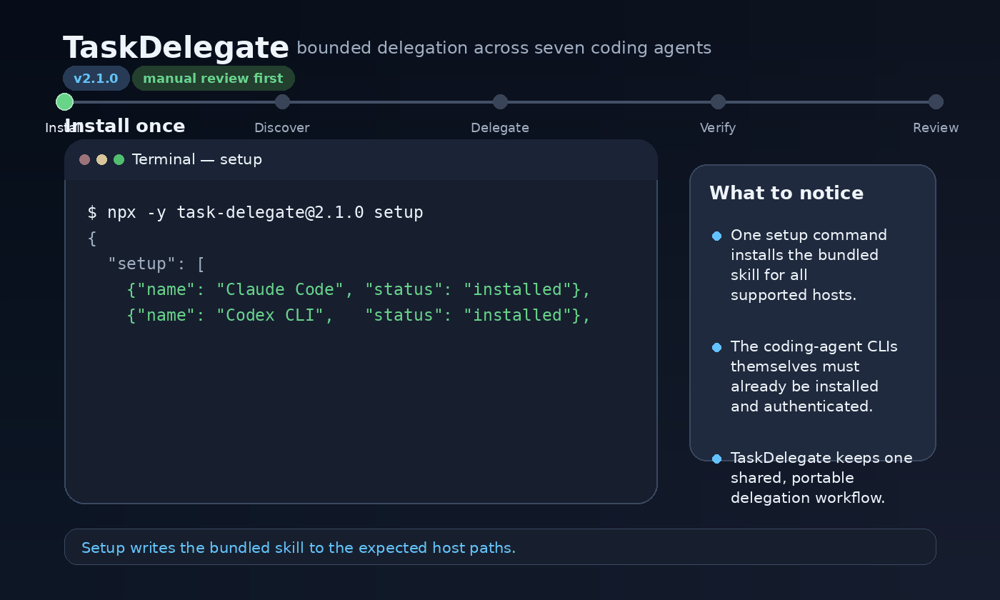

# TaskDelegate

[](https://www.npmjs.com/package/task-delegate)
[](https://www.npmjs.com/package/task-delegate)
[](LICENSE)
[](https://www.npmjs.com/package/task-delegate)
[](https://github.com/MOHJRNL/task-delegate/releases)
[](https://skills.sh/MOHJRNL/task-delegate)

**One portable interface for delegating bounded coding tasks to seven CLI agents—without handing them ownership of your repository.**

## What is TaskDelegate?

TaskDelegate is an open-source CLI and agent skill that delegates a narrowly scoped coding task to a supported local coding agent, verifies what changed, writes a normalized result, and leaves review and commit control with you.

It gives OpenCode, Codex, Claude Code, Kimi, z.ai, Grok, and Antigravity one consistent delegation workflow.

### At a glance

- One CLI and one portable agent skill
- Seven live-verified delegation targets
- Explicit target selection; no hidden auto-router
- Plan-only and implementation modes
- Clean-worktree protection
- Bounded retries, timeouts, and output capture
- Commit detection and Git diff inspection
- Normalized `task-delegate.result.v2` output
- No automatic commit, push, publish, or acceptance

Supported targets:

1. OpenCode
2. Codex
3. Claude Code
4. Kimi
5. z.ai through OpenCode
6. Grok
7. Antigravity

TaskDelegate v2.1.0 has been live-verified against all seven targets.

## Why use TaskDelegate?

Using several coding agents usually means remembering different commands, permission modes, workspace behaviors, and output formats. TaskDelegate standardizes that operational layer while keeping the delegated agent bounded and reviewable.

## How TaskDelegate works



```text
bounded task
  → discover seven supported targets
  → explicitly select one target
  → run it in the selected repository
  → inspect process, Git, and changed-file results
  → review the uncommitted diff
```

TaskDelegate is intentionally not an autonomous router. You select the target explicitly, and every implementation run remains subject to review.

## Requirements

- Node.js `18.17.0` or newer
- Git for repository verification
- At least one supported target CLI installed and authenticated

TaskDelegate installs its bundled skill, but it does not install or authenticate third-party coding CLIs.

## Install

### Run directly with npm

Run the current published release:

```bash
npx -y task-delegate@latest setup
```

### Install the CLI globally

```bash
npm install -g task-delegate
task-delegate setup
```

### Run from a local checkout

```bash
git clone https://github.com/MOHJRNL/task-delegate.git
cd task-delegate
npm link
task-delegate setup
```

Restart an already-open host CLI after setup so it can discover the installed skill.

## Quick start

List targets:

```bash
task-delegate targets
```

Delegate a task:

```bash
task-delegate delegate \
  --to codex \
  --task "Fix the failing tests without changing public behavior" \
  --cd .
```

Run in plan-only mode:

```bash
task-delegate delegate \
  --to claude \
  --mode plan \
  --task "Propose the smallest safe fix for the authentication bug" \
  --cd .
```

Inspect the generated result under:

```text
.task-delegate/runs/<run-id>/
```

Every run stores a compact brief, the delegated prompt, stdout, stderr, changed files, diff statistics, and a normalized `result.json`.

## Supported coding agents and invocation

TaskDelegate can be invoked from these supported coding-agent hosts using each host's skill syntax:

| Host | Invocation |
|---|---|
| OpenCode | `/task-delegate` |
| Claude Code | `/task-delegate` |
| Codex | `$task-delegate` |
| Kimi | `Use task-delegate` |
| Grok | `Use task-delegate` |
| Antigravity | `Use task-delegate` |

The host should display the same seven targets in the canonical order and ask you to choose one. Auto-select is intentionally not exposed.

## Main commands

```bash
task-delegate targets [--json]
task-delegate delegate [options]
task-delegate setup [--check|--dry-run]
task-delegate verify [--live] [--target <id>] [--jobs <n>] [--timeout-ms <n>] [--json]
task-delegate doctor
task-delegate hosts
task-delegate uninstall
task-delegate update
```

### Delegate options

```text
--to <opencode|codex|claude|kimi|zai|grok|agy>
--task <text>
--cd <path>
--mode <manual|plan>
--model <name>
--timeout-ms <number>
--retries <number>
--no-retry
--allow-dirty
--dry-run
--json
```

Defaults:

- mode: `manual`
- timeout: `180000` ms
- retries: one retry for transient launch or timeout failures only
- clean worktree required

## Setup and diagnostics

Install the bundled skill into the supported host locations:

```bash
task-delegate setup
```

Verify binaries, skill paths, and installed versions:

```bash
task-delegate setup --check
task-delegate doctor
task-delegate hosts
```

Preview setup without writing:

```bash
task-delegate setup --dry-run
```

Remove installed skill copies:

```bash
task-delegate uninstall
```

## Verification

Run deterministic checks:

```bash
npm run check
npm test
npm run pack:dry-run
```

Run real bounded smoke tests for installed and authenticated targets:

```bash
task-delegate verify \
  --live \
  --jobs 2 \
  --timeout-ms 180000
```

Verify one target:

```bash
task-delegate verify \
  --live \
  --target agy \
  --timeout-ms 180000
```

## Security model

TaskDelegate reduces risk; it does not make third-party agents inherently safe.

Core controls:

- explicit target selection
- explicit canonical project directory
- clean-worktree enforcement unless `--allow-dirty` is supplied
- no automatic commit or push
- detection and rejection of commits created by a backend
- bounded timeout and process-tree termination
- bounded stdout and stderr capture
- transient-only bounded retry
- symlink protection for run and installation paths
- normalized result validation
- changed-file and Git diff inspection
- no shell pipeline in the live verifier
- manual review required for every implementation run

Delegated prompts prohibit commits, pushes, history rewrites, secret access, writes outside the selected project, and unrequested destructive actions.

### Antigravity

Antigravity print mode cannot prompt for write permission. TaskDelegate therefore uses workspace binding, sandbox mode, and non-interactive permission approval for reliable headless editing.

That permission bypass is broad within the Antigravity execution context. Run it only in repositories you trust and review every diff.

### Grok

TaskDelegate runs Grok with the delegated process working directory set to the selected project. It does not currently pass a Grok-specific workspace or permission-approval flag.

## Dirty worktrees

TaskDelegate rejects a dirty repository by default:

```text
reason: dirty-worktree
```

You can override this deliberately:

```bash
task-delegate delegate \
  --to opencode \
  --task "Add the requested validation" \
  --cd . \
  --allow-dirty
```

When `--allow-dirty` is used, the result separates:

- pre-existing changed files
- newly changed files
- files whose attribution may be ambiguous

Review with extra care.

## Result contract

The normalized contract identifier is:

```text
task-delegate.result.v2
```

A backend's own success message is not proof of completion. TaskDelegate also checks process outcome, timeout state, changed files, Git state, commit creation, and result validity.

Large logs remain separate from `result.json`.

## Legacy compatibility

The older brief-based interface remains available for backward compatibility:

```bash
task-delegate run \
  --backend opencode \
  --mode plan \
  --brief examples/brief.sample.md \
  --cd .
```

New usage should prefer:

```bash
task-delegate delegate
```

See [MIGRATION.md](MIGRATION.md) for upgrading from npm version `0.2.1`.

## Troubleshooting

### A target is unavailable

Install and authenticate that target's CLI, then run:

```bash
task-delegate doctor
task-delegate setup --check
```

### The installed skill is stale

Reinstall the bundled current version:

```bash
task-delegate setup
task-delegate setup --check
```

Restart the host CLI afterward.

### A delegation times out

Increase the per-run timeout:

```bash
task-delegate delegate \
  --to codex \
  --task "Complete the bounded task" \
  --cd . \
  --timeout-ms 300000
```

TaskDelegate terminates the delegated process tree when the timeout is reached.

### Antigravity reports success but creates nothing

Do not trust its response status alone. Check the normalized TaskDelegate result and actual changed files. TaskDelegate's live verifier validates the requested file content and Git state.

## Frequently asked questions

### Does TaskDelegate install the coding agents?

No. TaskDelegate installs its own bundled skill. OpenCode, Codex, Claude Code, Kimi, Grok, and Antigravity must be installed and authenticated separately. z.ai is used through the OpenCode adapter.

### Does TaskDelegate choose an agent automatically?

No. Version 2.1.0 requires explicit target selection. Hidden or automatic routing is intentionally not exposed.

### Can a delegated agent commit or push code?

TaskDelegate instructs targets not to commit or push, detects a changed Git `HEAD`, and fails the run if a backend creates a commit. You still need to inspect the resulting diff.

### Where are delegation results stored?

Each run writes artifacts under `.task-delegate/runs/<run-id>/`, including `result.json`, logs, prompts, changed files, and diff statistics.

### Is TaskDelegate an autonomous multi-agent framework?

No. It is a bounded delegation interface. It dispatches one scoped task to one selected target and returns control for review.

## Development

```bash
npm run check
npm test
npm run delegate:dry-run
npm run pack:dry-run
```

The package has no runtime dependencies.

## License

Apache License 2.0. See [LICENSE](LICENSE) and [NOTICE](NOTICE).
